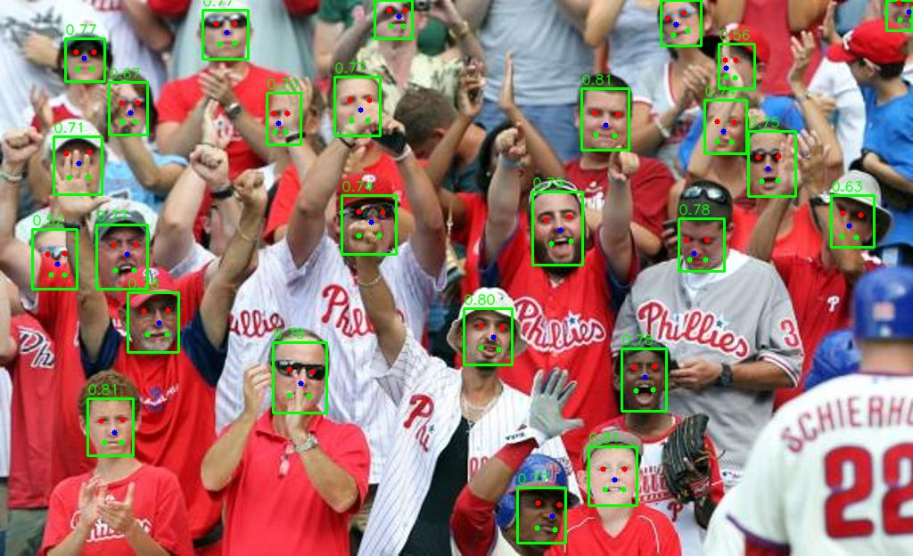
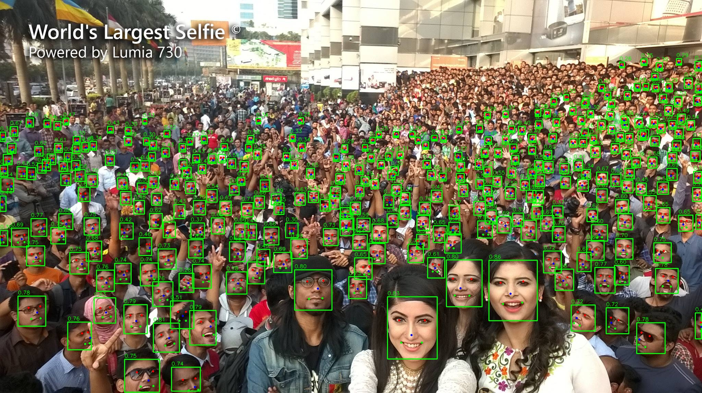

# YOLOv8-Face ONNX Inference

[](https://github.com/yakhyo/yolov8-face-onnx-inference)
[](https://github.com/yakhyo/yolov8-face-onnx-inference/releases)
[](https://github.com/yakhyo/yolov8-face-onnx-inference/blob/main/LICENSE)

Face detection with 5 facial landmarks using YOLOv8-Face ONNX Runtime inference.

<p align="center">
  
</p>

## Features

- ONNX Runtime GPU (CUDA) inference
- TorchVision NMS for real-time performance
- 5 facial landmarks: eyes, nose, mouth corners
- Support for image, video, and webcam

## Installation

### Clone the Repository

```bash
git clone https://github.com/yakhyo/yolov8-face-onnx-inference.git
cd yolov8-face-onnx-inference
```

### Install Required Packages

```bash
pip install -r requirements.txt
```

**Note:** Requires CUDA for GPU acceleration. For CPU-only, replace `onnxruntime-gpu` with `onnxruntime` in `requirements.txt`.

## Weights

### Download Models

```bash
bash download.sh yolov8-lite-s  # Lite-S model
bash download.sh yolov8n-face   # Nano model
```

### Model Performance

| Model         | Test Size | Easy | Medium | Hard | Model Size | Download |
| ------------- | --------- | ---- | ------ | ---- | ---------- | -------- |
| yolov8-lite-s | 640       | 93.4 | 91.2   | 78.6 | 7.4 MB     | [link](https://github.com/yakhyo/yolov8-face-onnx-inference/releases/download/weights/yolov8-lite-s.onnx) |
| yolov8n       | 640       | 94.6 | 92.3   | 79.6 | 12 MB      | [link](https://github.com/yakhyo/yolov8-face-onnx-inference/releases/download/weights/yolov8n-face.onnx) |

- **Easy/Medium/Hard**: mAP on WIDERFace validation subsets
- **yolov8-lite-s**: Lightweight model for resource-constrained applications
- **yolov8n**: Recommended for real-time face detection

## Usage

```bash
# Webcam (display auto-enabled)
python main.py --weights weights/yolov8n-face.onnx --source 0

# Image
python main.py --weights weights/yolov8n-face.onnx --source assets/test.jpg --save-img --view-img

# Video
python main.py --weights weights/yolov8n-face.onnx --source video.mp4 --save-img --view-img
```

### Arguments

```
python main.py -h
usage: main.py [-h] [--weights WEIGHTS] [--source SOURCE] [--conf-thres CONF_THRES] [--iou-thres IOU_THRES] [--max-det MAX_DET] [--save-img] [--view-img]

YOLOv8-Face ONNX Inference

options:
  -h, --help            show this help message and exit
  --weights WEIGHTS     Path to ONNX model file
  --source SOURCE       Path to image/video file or webcam index
  --conf-thres CONF_THRES
                        Confidence threshold
  --iou-thres IOU_THRES
                        NMS IoU threshold
  --max-det MAX_DET     Maximum detections per image
  --save-img            Save detected images
  --view-img            Display results (auto-enabled for webcam)
```

## Output

The model returns detections as `numpy.ndarray` with shape `[N, 15]` where N is the number of detected faces:

- **Bounding box** `[4]`: (x1, y1, x2, y2) - `numpy.float32`
- **Confidence score** `[1]`: Detection confidence - `numpy.float32`
- **Landmarks** `[10]`: 5 keypoints (x, y) - `numpy.float32`
  - Left eye (x, y)
  - Right eye (x, y)
  - Nose tip (x, y)
  - Left mouth corner (x, y)
  - Right mouth corner (x, y)


<p align="center">
  
</p>


## Reference

This project is based on [yakhyo/yolov8-face-onnx-inference](https://github.com/yakhyo/yolov8-face-onnx-inference). All credit for the original implementation goes to the original author.

- **Original repository**: [yakhyo/yolov8-face-onnx-inference](https://github.com/yakhyo/yolov8-face-onnx-inference)
- **YOLOv8-Face**: [derronqi/yolov8-face](https://github.com/derronqi/yolov8-face)
- **Ultralytics**: [ultralytics/ultralytics](https://github.com/ultralytics/ultralytics)
